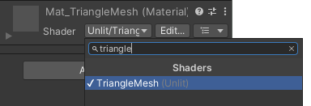

# Intel RealSense SDK の Unity Package の使い方

自分自身が [RealSense SDK (librealsense)](https://github.com/IntelRealSense/librealsense) の Unity Package の使い方を勉強しながら、Teams 上で学生さんに説明したので、その内容をここにメモっています。

## SDK のインストール

1. GitHub の librealsense の [Releases](https://github.com/IntelRealSense/librealsense/releases) の Assets にある SDK のインストーラ `Intel.RealSense.SDK-WIN10-2.*.*.*.exe` をダウンロードしてください。また Unity Package `Intel.RealSense.unitypackage` もダウンロードしてください。
2. SDK のインストーラを起動して SDK をインストールしてください。インストール完了後に `Realsense Viewer` の起動を促されます。これを起動すると PC に接続している RealSense の Firmware のアップデートを促されますので、アップデートしておいてください。RealSense Viewer はこのあと終了してください。
3. Unity Hub か Unity のエディタを起動して、新しいプロジェクトを作ってください。テンプレートは `3D` か `3D (URP)` を選んでください。`3D` は古いビルトインパイプライン、`3D (URP)` は Universal Render Pipeline と言って自分でレンダリングパイプラインを記述できる Scriptable Render Pipeline で、今はもっぱらこれが使われるみたいです。ここでは `3D (URP)` を選ぶことにします (このプロジェクトはうっかり `3D` すなわちビルトインパイプラインで作っちゃったけど、`3D (URP)` でも同じ手順でできると思います)。
4. `Assets` メニューから `Import Package... >` `Custum Package...` を選び、先ほどダウンロードした RealSense の Unity Package を開いてください。`Import Unity Package` というウィンドウがポップアップしますから、そのまま `Import` をクリックしてください。
5. Unity Package の Import が終わると Project ウィンドウに RealSenseSDK2.0 というフォルダができますから、その中の Scenes というフォルダを開いてください。中に StartHere というシーンがあります。これは、ここからすべてのシーンを起動するものです。これをダブルクリックして `▶` をクリックすれば、エディタ内で実行を開始します。
6. `学生`さんが最初に必要になるのは、このなかの PointCloudDepthAndColor だと思います。このシーン自体は Samples のフォルダの中にあります。また、同じフォルダにある PointCloudProcessingBlock には、Decimation や時間方向のフィルタ、穴ふさぎフィルタなどが組み込まれています。これには UI もついているので、UI を付けるときの参考にもなると思います。
	
PointCloudDepthAndColor を実行すると、こんな具合になります。視点はマウスで動かせます。


ただ、これは実際には点で描いているので、クローズアップするとこういうことになります。


これを三角形のメッシュで描いて、クローズアップしても隙間が空かないようにしたいと思います。

## 新しいシーンを作る

1. 自分で新しいシーンを作るときは、`File` メニューの `New Scene` を選ぶか、とりあえず Project ウィンドウの Assets の中にある Scenes に作られている SampleScene を使ってください。
2. Project ウィンドウの Assets の RealSenseSDK2.0 の Prefabs にある `PointCloud`、`RsDevice`、`RsProcessingPipe` の３つの Prefab を Hierarchy ウィンドウにドラッグ＆ドロップします。  
    
    * `RsDevice` が RealSense のインタフェースなので、RealSense が複数あるときは、これも複数 Hierarchy に置きます。その場合、センサごとに `RsDevice` の名前を変えておいた方が良いでしょう (`RsDevice0`, `RsDevice1`, ...)。
    * どの `RsDevice` がどの RealSense を担当するかは、Requested Serial Number で指定すればいいんじゃないかと思います。これは RealSense Viewer で調べることができます。
    * 実空間上の RealSense の位置を Unity の 3D 空間に反映する場合のように点群を `RsDevice` に連動して動かしたければ、PointCloud を `RsDevice` の下の階層に置いておくと良いじゃないかと思います。
    * 複数の RealSense から得た複数の点群をシーンに配置する場合は、それぞれの `RsDevice` の下に `PointCloud` を置いた方が良いでしょう。
3. Hierarchy ウィンドウの `RsProcessingPipe` が `RsDevice` のデータを加工するパイプラインになります。したがって、この Source には使用する RealSense を担当する `RsDevice` を指定し、Profile には使用する設定を選びます。いずれも `⊕` をクリックすれば、選択可能なものの一覧が出ます。検索欄に数文字打ち込めば、目的のものを見つけられると思います。  
    
    * これも RealSense が複数あるときは、複数 Hierarchy に置き、`RsDevice` ごとに `RsProcessingPipe` の名前を変えておいた方が良いんじゃないかと思います (`RsProcessingPipe0`, `RsProcessingPipe1`, ...)。
4. Profile は Project ウィンドウの Assets の RealSenseSDK2.0 の ProcessingPipe フォルダに入っており、PointCloudProcessingBlocks はここにあるすべての設定をまとめたものです。とりあえずこれを設定しておけばいいと思います。デプスとカラーしか使わないなら PointCloudDepthAndColor でもいいと思います。
5. Hierarchy ウィンドウの `PointCloud` は、この `RsProcessingPipe` からデータを受け取ります。これは Mesh Filter でメッシュを作成しない代わりに、RsPointCloudRenderer が Source に指定されている `RsProcessingPipe` からデータを受け取って描画します。  
    

この状態で `▶` をクリックすると、黒い点群が表示されます。


6. Hierarchy ウィンドウで `RsDevice` の `Color` ストリームを選択してください。  
    
7. Inspector でこれを有効にします。  
    
8. RsStreamTextureRenderer の Source には `RsProcessingPipe`、Stream には Color、Format には Rgb8 を選んでください。RealSense のカラーの生データは多分 RGB ではないので (確認してないけど YUV とか YUY2？)、`RsDevice` で RGB に変換したものを使うんだと思います。  
    
9. 次に、Color の Texture Binding のマテリアルに PointCloudMat を選んでください。これも検索欄に何文字か打ち込めば見つけられると思います。  
    
10. そうすると No Function のところで Material が選べるようになりますから、mainTexture を選んでください。これによって、カラーのテクスチャが RsPointCloudRenderer のマテリアルの (シェーダが参照する _MainTex) テクスチャに設定されます。  
    

この状態で `▶` をクリックすると、テクスチャが貼られます。


ただし、これは三角形メッシュでではなく点 (というか四角形) です。点のサイズは `PointCloud` の RsPointCloudRenderer の Point Size で指定します。三角形のメッシュにするにはインデックスのデータを作るなど、もう一工夫必要になります。

## Orbit Camera Control を組み込む

このままではカメラが遠いし動かすこともできないので、Project ウィンドウの Assets の RealSenseSDK2.0 の Misc の Utils にある OrbitCameraControl というスクリプトを組み込みます。Hierarchy ウィンドウの `Main Camera` を選択し Inspector の一番下の `Add Component` をクリックして、OrbitCameraControl を選んでください。


これでマウスを使ってカメラを操作することができるようになります。この OrbitCameraControl は結構便利で、他のものにも流用できると思います (他では Unity Editor のエラーが出ることがありますが、スクリプトの Start() の当該の部分を削除すると動きます)。

## スクリプトの解説

あと、スクリプトとシェーダについて、少し説明します。スクリプトは Assetes の RealSenseSDK2.0 の Scripts フォルダにあります。

まず RsDevice というスクリプトを開いてください。ダブルクリックすれば VisualStudio が起動すると思います。デフォルトの Multithread の場合、下記のように RealSense の起動時に開始されたスレッドで RealSense のフレームの取得を待ち、データが到着したら SampleEvent というイベントを発行するという処理を繰り返しています。

```csharp
/// <summary>
/// Worker Thread for multithreaded operations
/// </summary>
private void WaitForFrames()
{
    while (!stopEvent.WaitOne(0))
    {
        using (var frames = m_pipeline.WaitForFrames())
            RaiseSampleEvent(frames);
    }
}
```

なお Unity Thread の場合は、このスクリプトの最後の Update() で、次のようにフレームを取得して同様に SampleEvent を発行しています。

```csharp
void Update()
{
    if (!Streaming)
        return;
    if (processMode != ProcessMode.UnityThread)
        return;
    FrameSet frames;
    if (m_pipeline.PollForFrames(out frames))
    {
        using (frames)
            RaiseSampleEvent(frames);
    }
}
```

点群の描画を行っているのは RsPointCloudRenderer というスクリプトです。ここでは次のように入力フレーム frame がコンポジットフレーム (複数のデータが合成されているとき) はフレームセットのデプスのフレームから点の位置 Xyz32f を取り出してキュー `q` に入れています。

```csharp
private void OnNewSample(Frame frame)
{
    if (q == null)
        return;
    try
    {
        if (frame.IsComposite)
        {
            using (var fs = frame.As<FrameSet>())
            using (var points = fs.FirstOrDefault<Points>(Stream.Depth, Format.Xyz32f))
            {
                if (points != null)
                {
                    q.Enqueue(points);
                }
            }
            return;
        }
        if (frame.Is(Extension.Points))
        {
            q.Enqueue(frame);
        }
    }
    catch (Exception e)
    {
        Debug.LogException(e);
    }
}
```

そのあと (すべての `Update()` より後に実行される) `LateUpdate()` において、以下のように (メッシュサイズが変わったときにメッシュの作り直しをしたり、テクスチャがあればそれを更新したりした後で) `points.CopyVertices(vertices);` により点群から頂点位置を取り出した後、それを使って `mesh.vertices = vertices;` としてメッシュの頂点を更新しています。`mesh.UploadMeshData(false);` はそのメッシュのデータがこれ以降使われず描画後に破棄しても問題ないことを Mesh Renderer に伝えています。

```csharp
protected void LateUpdate()
{
    if (q != null)
    {
        Points points;
        if (q.PollForFrame<Points>(out points))
            using (points)
            {
                if (points.Count != mesh.vertexCount)
                {
                    using (var p = points.GetProfile<VideoStreamProfile>())
                        ResetMesh(p.Width, p.Height);
                }
                if (points.TextureData != IntPtr.Zero)
                {
                    uvmap.LoadRawTextureData(points.TextureData, points.Count * sizeof(float) * 2);
                    uvmap.Apply();
                }
                if (points.VertexData != IntPtr.Zero)
                {
                    points.CopyVertices(vertices);
                    mesh.vertices = vertices;
                    mesh.UploadMeshData(false);
                }
            }
    }
}
```

描画処理を `Update()` ではなく `LastUpdate()` で行っているのは、(デフォルトでは使われない) Unity Thread の場合に `Upload()` で点群の収集を行っているために、それより後で描画するためだと思います。(デフォルトの) Multithread なら描画と並行して点群の収集が行われるので、`Update()` で描画しても問題ない気がします。

点群自体はこの `vertices` に入っているので、点群そのものを使うならこれか、その前の points を使えばいいと思いおます。デプスに対してごにょごにょしようとするなら RsDevice スクリプトでフレームをいじるか、`RsProcessingPIpe` の ProcessFrame をいじる (この中で使っている Process っていう Abstruct クラスをオーバーライドする？) といいんじゃないでしょうか。

## 点群を三角形メッシュ化する

いよいよ本題に入ります。

### Renderer スクリプトの作成

1. Project ウィンドウの Assets の中に Scripts というフォルダを作ります。この Assets を選択した状態で、上の `Assets` メニューから `Create >` `Folder` を選び、フォルダを作成してください。フォルダ名は Scripts にしておくことにします。
2. Project ウィンドウの Assets の RealSenseSDK2.0 の Scripts にある RsPointCloudRenderer を、先ほど作成した Assets 直下の Scripts にコピーします。RsPointCloudRenderer を選択して `Ctrl+C` した後、Assets 直下の Scripts を選択して `Ctrl+V` してください。
3. コピーした Assets 直下の Scripts の RsPointCloudRenderer の名前を、(例えば) TriangleMeshRenderer に変更します。
4. TriangleMeshRenderer をダブルクリックして編集します。
5. クラス名を (例えば)  `TriangleMeshRenderer` にすることにします。クラス名の変更は、クラス名を右クリックして "名前の変更 `Ctrl+R`, `Ctrl+R`" で行った方が無難だと思います。

```csharp
[RequireComponent(typeof(MeshFilter), typeof(MeshRenderer))]
// public class RsPointCloudRenderer : MonoBehaviour
public class TriangleMeshRenderer : MonoBehaviour
{
```

6. `ResetMesh()` の前あたりに以下の `CreateTriangleMeshIndex()` というメソッドを追加します。このインデックスの作り方については、[メディアデザインセミナー2Bの資料](Documents/unity_mesh.pdf)などを参考にしてください。

```csharp
  private static int[] CreateTriangleMeshIndex(int slices, int stacks)
  {
    // 三角形の頂点の数
    int vertices = slices * stacks * 6;

    // 三角形のデータ
    int[] indeces = new int[vertices];

    // 三角形の頂点番号を求める
    for (int j = 0; j < stacks; ++j)
    {
      // 各段の左端の下側の頂点番号の格納先
      int f0 = j * slices * 6;

      // 各段の左端の下側の頂点の頂点番号
      int p0 = j * (slices + 1);

      for (int i = 0; i < slices; ++i)
      {
        // 左から i 番目の四角形の左下の頂点番号の格納先
        int fi = f0 + i * 6;

        // 左から i 番目の四角形の左下の頂点番号
        int pi = p0 + i;

        // １つ目の三角形の頂点番号
        indeces[fi + 0] = pi;
        indeces[fi + 1] = pi + 1;
        indeces[fi + 2] = pi + slices + 1;

        // ２つ目の三角形の頂点番号
        indeces[fi + 3] = pi + slices + 2;
        indeces[fi + 4] = pi + slices + 1;
        indeces[fi + 5] = pi + 1;
      }
    }

    // 作成したインデックスを返す
    return indeces;
  }
```

7. `ResetMesh()` で行っているインデックスの作成に `CreateTriangleMeshIndex()` をいます。

```csharp
    //var indices = new int[vertices.Length];
    //for (int i = 0; i < vertices.Length; i++)
    //  indices[i] = i;
    var indices = CreateTriangleMeshIndex(width - 1, height - 1);
```

8. このインデックスを `MeshTopology.Triangles` でメッシュに設定します。

```csharp
    //mesh.SetIndices(indices, MeshTopology.Points, 0, false);
    mesh.SetIndices(indices, MeshTopology.Triangles, 0, false);
```

### シェーダの作成

1. Project ウィンドウの Assets の中に Shaders というフォルダを作ります。この Assets を選択した状態で上の `Assets` メニューから `Create >` `Folder` を選び、フォルダを作成してください。フォルダ名は Shaders にしておくことにします。
2. 作成した Shaders フォルダを選択した状態で上の `Assets` メニューから `Create >` `Shader >` `Unlit Shader` を選択して、シェーダを作成してください。シェーダ名は TriangleMesh にすることにします。
3. このシェーダに `_UVMap` というプロパティを追加します。RealSense はデプスセンサ (ステレオカメラ) とカラーセンサが独立していて違う位置にあり、解像度も異なるため、点群の各点におけるカラーデータの画素位置 (テクスチャ座標, UV) を別のデータとして持っているからです。

```hlsl
Shader "Unlit/TriangleMesh"
{
    Properties
    {
        _MainTex ("Texture", 2D) = "white" {}
        _UVMap("UV", 2D) = "" {}  // 追加
    }
```

4. フォグは使わないのですが、この部分には変更を加えず、設定を残したままにしています。

```hlsl
    SubShader
    {
        Tags { "RenderType"="Opaque" }
        LOD 100

        Pass
        {
            CGPROGRAM
            #pragma vertex vert
            #pragma fragment frag
            // make fog work
            #pragma multi_compile_fog

            #include "UnityCG.cginc"

            struct appdata
            {
                float4 vertex : POSITION;
                float2 uv : TEXCOORD0;
            };

            struct v2f
            {
                float2 uv : TEXCOORD0;
                UNITY_FOG_COORDS(1)
                float4 vertex : SV_POSITION;
            };

```

5. `_UVMap` のサンプラ変数を追加します。

```hlsl
            sampler2D _MainTex;
            sampler2D _UVMap;  // 追加
            float4 _MainTex_ST;

```

6. RealSense の `RsProcessingPipe` から得られる点群データは上下が反転しているので、バーテックスシェーダで y 座標値の符号を反転します。

```hlsl
            v2f vert (appdata v)
            {
                // y 座標値を反転する
                v.vertex.y = -v.vertex.y;

                v2f o;
                o.vertex = UnityObjectToClipPos(v.vertex);
                o.uv = TRANSFORM_TEX(v.uv, _MainTex);
                UNITY_TRANSFER_FOG(o,o.vertex);
                return o;
            }

```

7. フラグメントシェーダでは、バーテックスシェーダから与えられるテクスチャ座標 `i.uv` を使って `_UVMap` をサンプリングし、カラーデータのテクスチャ座標 `uv` を得ます。このテクスチャ座標が範囲外の時は、画素を捨てます。

```hlsl
            fixed4 frag (v2f i) : SV_Target
            {
                // _UVMap をサンプリングしてテクスチャ座標 uv を得る
                float2 uv = tex2D(_UVMap, i.uv);
                if (any(float4(uv, 1.0 - uv) <= 0.0)) discard;

```

8. このテクスチャ座標 `uv` を使ってカラーデータ _MainTex をサンプリングして、フラグメントの色を求めます。

```hlsl
                // sample the texture
                fixed4 col = tex2D(_MainTex, uv);  // uv をテクスチャ座標に使う
                // apply fog
                UNITY_APPLY_FOG(i.fogCoord, col);
                return col;
            }
            ENDCG
        }
    }
}
```

多分、この用途ではフォグや `TRANSFORM_TEX` によるテクスチャ座標の位置調整は不要だと思うので、削除しても構わない (むしろ削除した方がいい) んじゃないかと思います。

### マテリアルの作成

1. Project ウィンドウの Assets の中に Resources というフォルダを作ります。この Assets を選択した状態で上の `Assets` メニューから `Create >` `Folder` を選び、フォルダを作成してください。フォルダ名は Resources にしてください。
2. この Resources フォルダを選択した上で、再度、上の `Assets` メニューから `Create >` `Folder` を選び、フォルダを作成してください。フォルダ名は Materials にすることにします。このプロジェクトではこんなに深いフォルダを作る必要はないと思うのですが、Unity のスクリプトから参照するファイルのパスはこの Assets の下の Resources からの相対パスになっているみたいなので、それに合わせます。
3. 作成したフォルダ Materials を選択した状態で上の `Assets` メニューから `Create >` `Material` を選択して、マテリアルを作成してください。マテリアル名は TriangleMeshMat にすることにします。
4. Inspector で Shader に先ほど作った TriangleMesh を選びます。  
    
5. Hierarchy ウィンドウで `RsDevice` の `Color` ストリームを選択し、Inspector で RsStreamTextureRenderer の Source に `RsProcessingPipe`、Stream に Color、Format に Rgb8 が選ばれていることを確認してください。
6. Texture Binding のマテリアルに TriangleMeshMat を選んでください。その際、Material.mainTexture が選ばれていることを確認してください。  
    

### TriangleMesh オブジェクトの作成

1. Hierarchy ウィンドウで `PointCloud` を選択し、上の `Edit` メニューから `Delete` を選ぶか、`Delete キー`をタイプして削除します。
2. 上の `GameObject` メニューから `Create Empty` `Ctrl+Shift+N` を選び、空の Game Object を作成します。オブジェクト名は、これも `TriangleMesh` とかにしておきます。
3. この `TriangleMesh` を選択した状態で上の `Component` メニューから `Mesh >` `Mesh Filter` を選ぶか、Inspactor の一番下の `Add Component` をクリックして Mesh Filter を選んで、Mesh Filter を追加します。
4. 同様に、この `TriangleMesh` を選択した状態で上の `Component` メニューから `Mesh >` `Mesh Renderer` を選ぶか、Inspactor の一番下の `Add Component` をクリックして Mesh Renderer を選んで、Mesh Renderer を追加します。
5. 追加した Mesh Renderer の Material の Element0 に TriangleMeshMat を選びます。  
    
6. Inspector の一番下の `Add Component` をクリックして、Triangle Mesh Renderer を選んでください。  
    
7. Triangle Mesh Renderer の Source に `RsProcessingPipe` を選びます。  
    
8. Triangle Mesh Renderer の Material の Shader に TriangleMesh を選びます。  
    

これでようやくこういう結果が得られます (点群と色が若干ずれている気がするのは RealSense をしょっちゅう落っことしたりしたのにキャリブレーションし直していないからですかね？)。


でも残念ながら、視点を動かすと、これはこういう表示になっています。


これは RealSense が計測不能だったりした点の位置を (0, 0, 0) にしてしまうため、三角形のメッシュで表示したときに３つの頂点のうち１つが (0, 0, 0) の三角形がそこまで伸びて表示されるからです。そこで、これを避けるために、どれか１つの頂点でも (0, 0, 0) になっている三角形は描かないようにします。それには (あんまり使いたくないけど) ジオメトリシェーダを使います。

### ジオメトリシェーダの追加

1. Project ウィンドウの Assets 直下の Shaders フォルダに入っている (はずの) TriangleMesh シェーダのソースファイルを編集します。
2. このシェーダが `geom` という名前のジオメトリシェーダを含むことを宣言します。  

```hlsl
Shader "Unlit/TriangleMesh"
{
    Properties
    {
        _MainTex ("Texture", 2D) = "white" {}
        _UVMap("UV", 2D) = "" {}
    }
    SubShader
    {
        Tags { "RenderType"="Opaque" }
        LOD 100

        Pass
        {
            CGPROGRAM
            #pragma vertex vert
            #pragma geometry geom  // 追加
            #pragma fragment frag
            // make fog work
            #pragma multi_compile_fog

```

3. バーテックスシェーダで頂点の位置が (0, 0, 0) なら、その w も 0 にして次段のジオメトリシェーダに送ります。RealSense の計測範囲は有限なので、w = 0 すなわち無限遠のデータを取得していることはないはずです。

```hlsl
            #include "UnityCG.cginc"

            struct appdata
            {
                float4 vertex : POSITION;
                float2 uv : TEXCOORD0;
            };

            struct v2f
            {
                float2 uv : TEXCOORD0;
                UNITY_FOG_COORDS(1)
                float4 vertex : SV_POSITION;
            };

            sampler2D _MainTex;
            sampler2D _UVMap;
            float4 _MainTex_ST;

            v2f vert (appdata v)
            {
                // 頂点の位置が (0, 0, 0) なら w も 0 にして出力する
                if (all((float3)v.vertex == 0.0))
                {
                    v.vertex.w = 0.0;
                    return v;
                }

                v.vertex.y = -v.vertex.y;

                v2f o;
                o.vertex = UnityObjectToClipPos(v.vertex);
                o.uv = TRANSFORM_TEX(v.uv, _MainTex);
                UNITY_TRANSFER_FOG(o,o.vertex);
                return o;
            }

```

4. 以下の内容のジオメトリシェーダを追加します。これは渡された３つの頂点 `v[3]` のどれか１つでも w = 0 だったら頂点を１つも出力しません。`[maxvertexcount(3)]` はこのシェーダが最大で３つの頂点を出力することを示しています。

```hlsl
            [maxvertexcount(3)]
            void geom (triangle v2f v[3], inout TriangleStream<v2f> ts)
            {
                if (any(float3(v[0].vertex.w, v[1].vertex.w, v[2].vertex.w) == 0.0)) return;

                ts.Append(v[0]);
                ts.Append(v[1]);
                ts.Append(v[2]);
            }

```

5. フラグメントシェーダには変更ありません。

```hlsl
            fixed4 frag (v2f i) : SV_Target
            {
                float2 uv = tex2D(_UVMap, i.uv);
                if (any(float4(uv, 1.0 - uv) <= 0.0)) discard;

                // sample the texture
                fixed4 col = tex2D(_MainTex, uv);
                // apply fog
                UNITY_APPLY_FOG(i.fogCoord, col);
                return col;
            }
            ENDCG
        }
    }
}
```

これで (0, 0, 0) に向かって伸びていた三角形が削除されます。


RealSense の D400 シリーズは (アクティブ) ステレオカメラなので、カメラに近い計測対象の周囲に視差による閉塞 (occulusion) により計測できない場所が生じることがあります (これが生じない LiDAR の L515 がディスコンなのは残念)。ここではその部分の三角形を単に削除しているので、そこに隙間 (穴) が生じています。

RealSense SDK にはそういう穴をふさぐ関数が用意されていますが (サンプルの PointCloudProcessingBlocks というシーンで使っています)、[このプログラム](https://github.com/tokoik/getdepth)ではそれを使わず、GPU を使って自前実装しています。今後はそれも Unity で実装しようと考えています。

### おまけ

以上はフォグの処理に手を加えずにコードの追加のみを行って実装しましたが、フォグの処理を削除すればシェーダの記述がもっと簡単になります。以下のバーテックスシェーダ `vert()` は戻り値の型が `v2f` ですが、戻り値として返している `v` は `appdata` 型の引数です。`v2f` と `appdata` はシェーダセマンティクスが異なりますが、構造を同じにしておけば問題なくデータを渡すことができるようです (多分そういうことはしない方が良いと思うけど)。

```hlsl
Shader "Unlit/TriangleMesh"
{
    Properties
    {
        _MainTex ("Texture", 2D) = "white" {}
        _UVMap("UV", 2D) = "" {}
    }
    SubShader
    {
        Tags { "RenderType"="Opaque" }
        LOD 100

        Pass
        {
            CGPROGRAM
            #pragma vertex vert
            #pragma geometry geom
            #pragma fragment frag

            #include "UnityCG.cginc"

            struct appdata
            {
                float4 vertex : POSITION;
                float2 uv : TEXCOORD0;
            };

            struct v2f
            {
                float4 vertex : SV_POSITION;
                float2 uv : TEXCOORD0;
            };

            sampler2D _MainTex;
            sampler2D _UVMap;

            v2f vert (appdata v)
            {
                if (all((float3)v.vertex == 0.0))
                {
                    v.vertex.w = 0.0;
                    return v;
                }

                v.vertex.y = -v.vertex.y;
                v.vertex = UnityObjectToClipPos(v.vertex);
                return v;
            }

            [maxvertexcount(3)]
            void geom (triangle v2f v[3], inout TriangleStream<v2f> ts)
            {
                if (any(float3(v[0].vertex.w, v[1].vertex.w, v[2].vertex.w) == 0.0)) return;

                ts.Append(v[0]);
                ts.Append(v[1]);
                ts.Append(v[2]);
            }

            fixed4 frag (v2f i) : SV_Target
            {
                float2 uv = tex2D(_UVMap, i.uv);
                if (any(float4(uv, 1.0 - uv) <= 0.0)) discard;
                return tex2D(_MainTex, uv);
            }
            ENDCG
        }
    }
}
```

## Forward Rendering にしてみる

Unity のレンダリングパイプラインは他のゲームエンジンと同様、Deferred Rendering (遅延レンダリング) が標準になっています。Deferred Rendering はディスプレイへの表示を行う通常のフレームバッファに図形を直接描かずに、一旦、画面に表示されないフレームバッファ、いわゆるオフスクリーンバッファに描いた後に、それを使って最終的なレンダリング結果を生成する手法です。このオフスクリーンバッファには通常のフレームバッファが備えるカラーとデプスの他に、用途に応じて様々な用途を組み合わせて格納できるようになっています。

近年のハイクォリティなゲームでは凝ったマテリアルやリアルな照明効果、あるいは複雑な映像効果を実現するのが当たり前になっています。それにはレンダリングの途中経過など、様々な要素を組み合わせる必要があります。そこで、あらかじめオフスクリーンバッファにそういう要素を別々にレンダリングしておき、事後処理により最終的なレンダリング結果を得るようにします。こうすれば高度な映像表現が行えるだけでなく、そういう手間をかけた表現が隠面消去処理によって消されて無駄になってしまうことを避けることができ、レンダリングのパフォーマンスも向上が見込めます。なお、このようなオフスクリーンバッファを *G-バッファ*と言います。これは日本発の技術です (Saito, Takafumi, and Tokiichiro Takahashi. "Comprehensible rendering of 3-D shapes." Proceedings of the 17th annual conference on Computer graphics and interactive techniques. 1990.)。

しかし点群の表示のように、レンダリングプリミティブ数が非常に多いにもかかわらず、それほど高度な映像効果が必要ない場合は、Deferred Rendering のオーバーヘッドが負担になります。その場合はグラフィックス API を使って直接通常のフレームバッファに描いたほうが良い場合もあります。それを Forward Rendering と言います。ちなみに私は Forward Rendering という用語を初めて聞いた時は何か新しい技術課と思ったのですが、意味を知って「え、普通に API で直接描いているだけじゃん」と思いました。ゲームエンジンのパイプラインに組み込んだこと自体が新しかったのかもしれませんけど。

### スクリプトの修正

Game Object の `TriangleMesh` の Mesh Renderer に組み込んだスクリプトの TriangleMeshRenderer を修正します。Mesh Renderer は G-バッファにレンダリングするために使うので、Forward Rendering では使用しません。したがって Mesh Renderer や Mesh Filter は不要なのですが、ここで削除すると手順が増えるので残しておきます。一方 Mesh は使わないので、`TriangleMeshRenderer` クラスからは削除します。代わりに、この Mesh に組み込んでいた頂点やインデックスのデータを保持する `GraphicsBuffer` のメンバ変数 `vertexBuffer` と `indexBuffer` を追加します。また `Material` を保持するメンバ変数 `material` も追加しておきます。

```csharp
[RequireComponent(typeof(MeshFilter), typeof(MeshRenderer))]
// public class RsPointCloudRenderer : MonoBehaviour
public class TriangleMeshRenderer : MonoBehaviour
{
  public RsFrameProvider Source;
  //private Mesh mesh;
  private GraphicsBuffer vertexBuffer = null;
  private GraphicsBuffer indexBuffer = null;
  private Material material = null;
  private Texture2D uvmap;

```

RealSense に対応したメッシュの出たを作成するメソッド `ResetMesh()` では、Mesh Renderer に組み込んでいた `Material` を、メンバ変数 `material` に保持するようにします。なお、Mesh Renderer を削除した場合は `Resources.Load()` を使って読み込む必要があります。

```csharp
  private void ResetMesh(int width, int height)
  {
    Assert.IsTrue(SystemInfo.SupportsTextureFormat(TextureFormat.RGFloat));
    uvmap = new Texture2D(width, height, TextureFormat.RGFloat, false, true)
    {
      wrapMode = TextureWrapMode.Clamp,
      filterMode = FilterMode.Point,
    };
    //GetComponent<MeshRenderer>().sharedMaterial.SetTexture("_UVMap", uvmap);
    material = GetComponent<MeshRenderer>().sharedMaterial;
    material.SetTexture("_UVMap", uvmap);

```

Mesh は使わないので、それに関連するコードは削除します。代わりに、頂点データを格納する `GraphicsBuffer` を `vertexBuffer` に確保します。また、それをシェーダに渡すために `material` にセットします。

```csharp
    //if (mesh != null)
    //  mesh.Clear();
    //else
    //  mesh = new Mesh()
    //  {
    //    indexFormat = IndexFormat.UInt32,
    //  };

    vertices = new Vector3[width * height];
    if (vertexBuffer != null)
      vertexBuffer.Release();
    vertexBuffer = new GraphicsBuffer(GraphicsBuffer.Target.Structured,
      vertices.Length, sizeof(float) * 3);
    material.SetBuffer("_Vertex", vertexBuffer);

```

同様にイデックスデータを格納する `GraphicsBuffer` を `indexBuffer` に確保します。

```csharp
    //var indices = new int[vertices.Length];
    //for (int i = 0; i < vertices.Length; i++)
    //  indices[i] = i;
    var indices = CreateTriangleMeshIndex(width - 1, height - 1);
    if (indexBuffer != null)
      indexBuffer.Release();
    indexBuffer = new GraphicsBuffer(GraphicsBuffer.Target.Index,
      indices.Length, sizeof(int));
    indexBuffer.SetData(indices);

```

この後の Mesh に関連するコードは削除します。その結果、テクスチャ座標 UV を渡すことができなくなってしまいますが、これは後で何とかします。

```csharp
    //mesh.MarkDynamic();
    //mesh.vertices = vertices;

    //var uvs = new Vector2[width * height];
    //Array.Clear(uvs, 0, uvs.Length);
    //for (int j = 0; j < height; j++)
    //{
    //  for (int i = 0; i < width; i++)
    //  {
    //    uvs[i + j * width].x = i / (float)width;
    //    uvs[i + j * width].y = j / (float)height;
    //  }
    //}

    //mesh.uv = uvs;

    //mesh.SetIndices(indices, MeshTopology.Points, 0, false);
    //mesh.SetIndices(indices, MeshTopology.Triangles, 0, false);
    //mesh.bounds = new Bounds(Vector3.zero, Vector3.one * 10f);

    //GetComponent<MeshFilter>().sharedMesh = mesh;
  }
```

`OnDestroy()` ではもともと Mesh が作られていたら `Dispose()` が呼ばれていたので、代わりに `vertexBuffer` が作られていたら、それを開放するついでに Game Object を `Dispose()` することにします。これでいいんでしょうか。

```csharp
  void OnDestroy()
  {
    if (q != null)
    {
      q.Dispose();
      q = null;
    }

    //if (mesh != null)
    //  Destroy(null);
    if (indexBuffer != null)
      indexBuffer.Release();
    if (vertexBuffer != null)
    {
      vertexBuffer.Release();
      Destroy(null);
    }
  }
```

RealSense から頂点データを取り出して Mesh を更新していた `LastUpdate()` では、これまで `points` に取り出した頂点の数が Mesh の頂点の数と比較して違っていたら Mesh を作り直していました。Mesh を使わなくなったので、代わりにこれを (頂点データの一時保管に使う) `vertices` の長さと比較することにします。

```csharp
  protected void LateUpdate()
  {
    if (q != null)
    {
      Points points;
      if (q.PollForFrame<Points>(out points))
        using (points)
        {
          //if (points.Count != mesh.vertexCount)
          if (points.Count != vertices.Length)
          {
              using (var p = points.GetProfile<VideoStreamProfile>())
              ResetMesh(p.Width, p.Height);
          }

```

そのあと `points` の頂点データを一時保管用の配列 `vertices` にコピーして Mesh に設定していましたが、これも Mesh の代わりに `GraphicsBuffer` の `vertexBuffer` に格納するようにします。本当は `uvmap` 同様 `points.VertexData` を直接 `vertexBuffer` にコピーしたかったんですけど、`points.VertexData` の先のデータを `vertexBuffer.GetNativeBufferPtr()`　の先にコピーする方法がわかりませんでした (`Marshal.Copy()` を使う？)。

```csharp
          if (points.TextureData != IntPtr.Zero)
          {
            uvmap.LoadRawTextureData(points.TextureData, points.Count * sizeof(float) * 2);
            uvmap.Apply();
          }

          if (points.VertexData != IntPtr.Zero)
          {
            points.CopyVertices(vertices);

            //mesh.vertices = vertices;
            //mesh.UploadMeshData(false);
            vertexBuffer.SetData(vertices);
          }
        }
    }
  }
```

最後に `OnRenderObject()` メソッドを追加します。この Game Object の `TriangleMesh` では Mesh Renderer では描画しませんから、`OnRenderObject()` で `Graphics.DrawProceduralNow()` により直接描画します。

```csharp
  void OnRenderObject()
  {
    if (indexBuffer != null)
    {
      material.SetPass(0);
      Graphics.DrawProceduralNow(MeshTopology.Triangles, indexBuffer, indexBuffer.count);
    }
  }
}
```

### シェーダの修正

ここでは Mesh Renderer を使わず Mesh を削除してしまったので、テクスチャ座標 UV を渡していません。それで「後で何とかします」ということで、シェーダで何とかすることにします。マテリアルの `TriangleMeshMat` に組み込んだシェーダの TriangleMesh を修正します。

バーテックスシェーダ `vert()` に入力する頂点属性には位置 `POSITION` もテクスチャ座標 `TEXCOORD0` も存在しなくなったので、その構造体 `appdata` は削除してしまいます。

```hlsl
Shader "Unlit/TriangleMesh" {
  Properties{
    _MainTex("Texture", 2D) = "white" {}
    _UVMap("UV", 2D) = "" {}
  }

    SubShader
  {
    Pass
    {
      CGPROGRAM
      #pragma vertex vert
      #pragma geometry geom
      #pragma fragment frag

      #include "UnityCG.cginc"

      //struct appdata
      //{
      //  float4 vertex : POSITION;
      //  float2 uv : TEXCOORD0;
      //};

      struct v2f
      {
        float4 vertex : SV_POSITION;
        float2 uv : TEXCOORD0;
      };

```

代わりに「本当の」テクスチャ座標 UV が入っている `_UVMap` のテクスチャサイズ `_UVMap_TexelSize` と、`GraphicsBuffer` の　`vertexBuffer` を受け取る `StructuredBuffer` の `_Vertex` を追加します。

```hlsl
      sampler2D _MainTex;
      sampler2D _UVMap;
      float4 _UVMap_TexelSize;
      StructuredBuffer<float3> _Vertex;

```

そしてバーテックスシェーダ `vert()` では頂点番号 `SV_VertexID` を `vertex_id` として受け取り、それを使って `_Vertex` から頂点の位置を取り出します。こういう風にしたのは、このあと Compute Shader を使ってごにょごにょしたいと思っていることもあるからですね。

```hlsl
      v2f vert(uint vertex_id : SV_VertexID)
      {
        v2f v;
        v.vertex = float4(_Vertex[vertex_id], 1.0);

```

そして `_UVMap` をサンプリングするためのテクスチャ座標 UV を `vertex_id` と `_UVMap_TexelSize` を使って求めます。

```hlsl
        if (all((float3)v.vertex == 0.0))
        {
          v.vertex.w = 0.0;
          return v;
        }

        // UV を vertex_id から求める
        v.uv = float2(fmod(vertex_id, _UVMap_TexelSize.z) * _UVMap_TexelSize.x,
          floor(vertex_id * _UVMap_TexelSize.x) * _UVMap_TexelSize.y);
        v.vertex.y = -v.vertex.y;
        v.vertex = UnityObjectToClipPos(v.vertex);
        return v;
      }
```

### Mesh Renderer の削除

Mesh Renderer は使わなくなったので、ここで削除します。そのあと Triangle Mesh Renderer から直接マテリアルを参照するようにします。

1. Hierarchy ウィンドウで `TriangleMesh` オブジェクトを選択し、Inspector で Triangle Mesh Renderer (Script) → Mesh Renderer → Mesh Filter の順に削除 (`︙` から Remove Component を選択) してください。
   * この結果 `TriangleMesh` オブジェクトは Empty になります。
2. スクリプトの TriangleMeshRenderer を修正します。まず、このスクリプトを組み込んだ時に Mesh Filter と Mesh Renderer が自動的に組み込まれないように、`[RequireComponent ... ]` を削除します。また、このスクリプトから直接マテリアルを参照するために、メンバ変数 `material` を `[SerializeField]` にするか、public にします。

```csharp
//[RequireComponent(typeof(MeshFilter), typeof(MeshRenderer))]
//public class RsPointCloudRenderer : MonoBehaviour
public class TriangleMeshRenderer : MonoBehaviour
{
  public RsFrameProvider Source;
  //private Mesh mesh;
  private GraphicsBuffer vertexBuffer = null;
  private GraphicsBuffer indexBuffer = null;
  [SerializeField]
  private Material material;
  private Texture2D uvmap;

  [NonSerialized]
  private Vector3[] vertices;

  FrameQueue q;
```

3. マテリアルはこのスクリプトのプロパティで設定しますから、コンポーネントから取り出す必要はありません。

```csharp
  private void ResetMesh(int width, int height)
  {
    Assert.IsTrue(SystemInfo.SupportsTextureFormat(TextureFormat.RGFloat));
    uvmap = new Texture2D(width, height, TextureFormat.RGFloat, false, true)
    {
      wrapMode = TextureWrapMode.Clamp,
      filterMode = FilterMode.Point,
    };
    //GetComponent<MeshRenderer>().sharedMaterial.SetTexture("_UVMap", uvmap);
    //material = GetComponent<MeshRenderer>().sharedMaterial;
    material.SetTexture("_UVMap", uvmap);

```

4. この Triangle Mesh Render を Game Object の `TriangleMesh` に追加します。  
    
5. Inspector で Triangle Mesh Renderer (Script) の Source に `RsProcessingPipe` を選びます。  
    
6. Material には `TriangleMeshMat` を選びます。  
    
